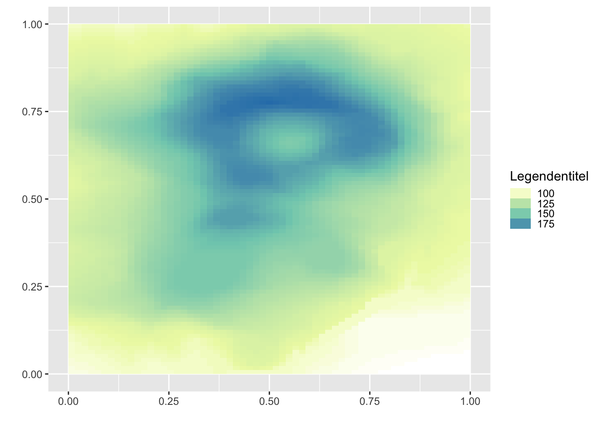

# Grafiken {#grafiken}


## Nützliche Resourcen

### Links
- (ggplot3)[https://ggplot2-book.org/]: Bookdown Version. Work in Progress Version des ggplot2 Buches.

## Karten mit ggplot

Mit ggplot können auch räumliche Daten als Karten dargestellt werden. Im folgenden ein Beispiel mit Rasterdaten. Diese müssen erst in ein Dataframe umgewandelt werden und können dann wieder als Raster geplottet werden. 


```r
d <- raster(volcano) %>% 
  rasterToPoints() %>% 
  as_tibble()

ggplot() +
  geom_raster(data = d, aes(x = x, y = y, fill = layer)) +
  labs(x = "", y = "") +
  scale_fill_gradientn(
    colours = c("White", "#EDF8B1", "#7FCDBB", "#2C7FB8"),
    values = c(0, 0.1, 0.6, 1),
    name = "Legendentitel",
    guide = guide_legend(keyheight = unit(3, units = "mm"))
    ) 
```



